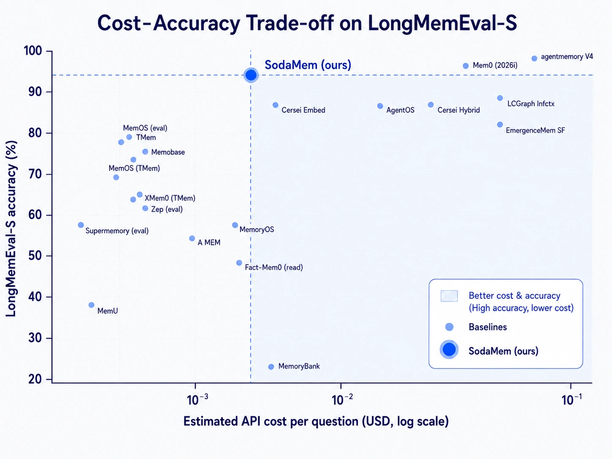
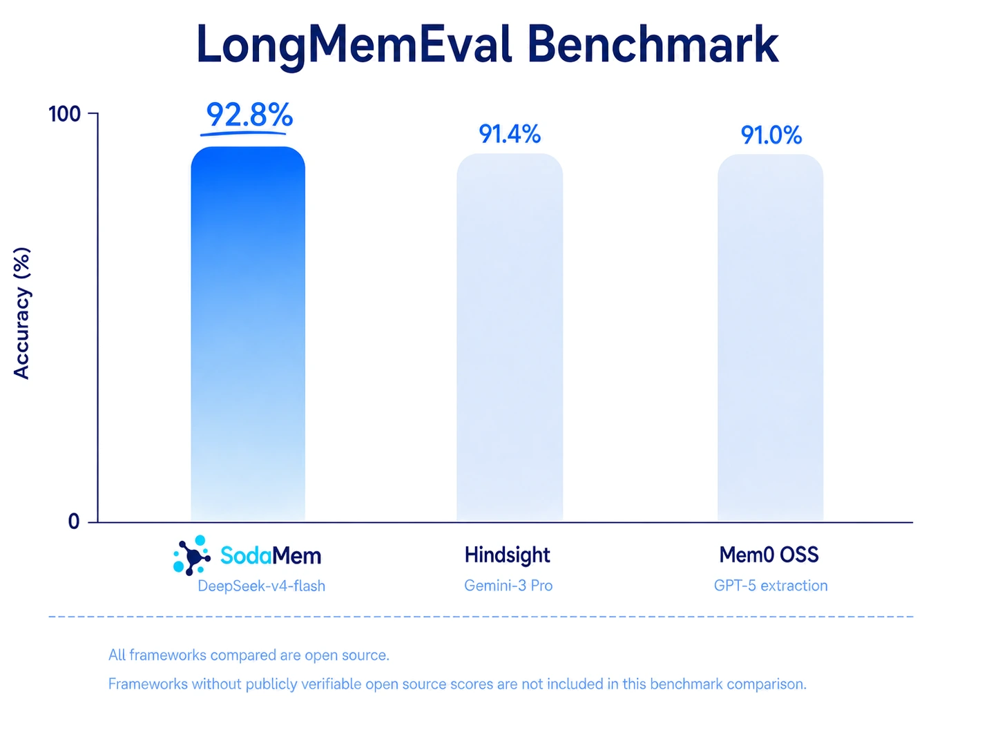
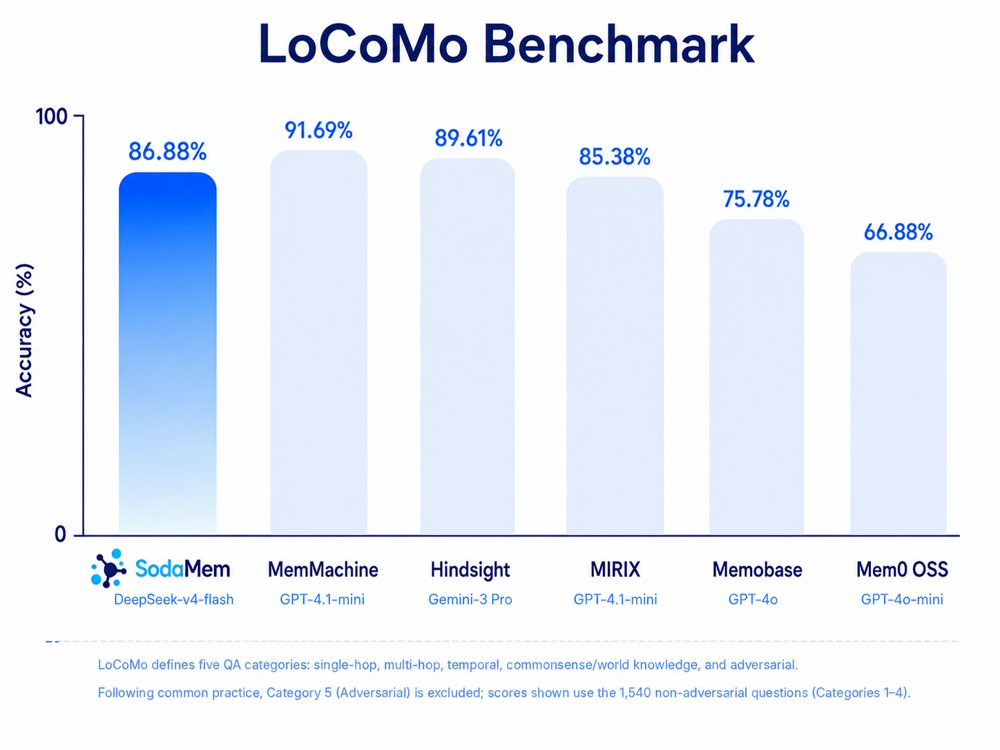

<div align="center">

<picture>
  <source media="(prefers-color-scheme: dark)" srcset="../assets/logo-dark.webp">
  
</picture>

**AI 에이전트를 위한, 근거를 추적할 수 있는 시간축 메모리.**

모든 기억이 자신이 어느 발화에서 나왔는지 말할 수 있고, 언제부터 참이 아니게 되었는지 압니다.

[](../../LICENSE)
[](../../pyproject.toml)
[](../../benchmarking/artifacts/)
[](../../benchmarking/README.md#locomo-cat-1-4)
[](https://github.com/SodaMem/SodaMem/discussions)

<!-- langs -->
[English](../../README.md) · [简体中文](README.zh-CN.md) · [日本語](README.ja.md) · **한국어** · [Français](README.fr.md) · [Español](README.es.md) · [Deutsch](README.de.md) · [Português](README.pt-BR.md)
<!-- /langs -->



*세로축은 정확도, 가로축은 질문당 추정 API 비용입니다. 의미 있는 사분면은 왼쪽 위입니다.*

</div>

---

```bash
pip install "sodamem[chroma,llm]"
```

```python
from sodamem import SodaMem
from sodamem.llm import create_provider_from_env      # SODAMEM_LLM_API_KEY
from sodamem.memory.ingest.extractor import FactEventExtractorV2

# 쓰기에는 사실을 추출할 모델이 필요하고, 읽기에는 전혀 필요 없습니다.
mem = SodaMem.open("./data", extractor=FactEventExtractorV2(create_provider_from_env()))

mem.ingest(
    [{"role": "user", "content": "사실 카우아이에서 오아후로 바꿨어요."}],
    user_id="u1", session_id="s1", session_time="2023-05-25",
)

block = mem.build_context("어디에 묵을 예정이지?", user_id="u1", token_budget=1000)
print(block.text)        # 프롬프트에 그대로 넣을 수 있음 — LLM 호출 0회
print(block.citations)   # 그 문장 한 줄 한 줄의 근거
```

`SodaMem.open()` 은 `./data` 가 없으면 만듭니다. extractor 가 필요한 것은
`.ingest()` 뿐이라, 이 인자를 빼면 읽기 전용 스토어가 되고 `search` /
`build_context` 는 그대로 동작합니다.

**여러분의 데이터는 기기를 떠나지 않습니다.** 텔레메트리 없음, 분석 없음,
콜백 없음 — 기본 설치가 보내는 유일한 외부 요청은 90MB MiniLM 임베딩
모델을 `~/.cache/chroma/` 로 한 번 내려받는 것뿐이며, 그 뒤로는 디스크와만
통신합니다. 이 캐시를 미리 채워두면 완전한 오프라인으로 동작합니다.

---

## 왜 또 하나의 메모리 계층인가

대부분의 메모리 시스템이 저장하는 것은 **무엇을 말했는가**입니다. 정작 시스템을
무너뜨리는 질문은 **그것이 언제부터 참이 아니게 되었는가**와 **어디에서 왔는가**
입니다. 이 둘은 데이터 모델로 풀어야 할 문제이지, 벡터 인덱스를 키운다고
해결되지 않습니다.


| 질문 | 흔한 답 | SodaMem |
|---|---|---|
| 이 기억은 어디서 왔는가? | 유사도 점수와 메타데이터 몇 개 | `FactEvent → SourceSpan → RawTurn` 외래키 사슬이 정확히 그 턴까지 짚어 준다 |
| 사용자가 말을 바꾸면? | 덮어쓰기, 옛 값은 사라짐 | 추가만 하고 `SUPERSEDES` 간선을 건다. 옛 버전은 `valid_until`로 닫히고 계속 읽힌다 |
| "작년에 시카고로 이사했다" vs "내년에 이사한다" | 타임스탬프 하나 | 네 개의 시간 축: 발생 / 유효 / 발화 / 저장 |
| 검색 한 번의 비용은? | 검색마다 LLM 호출 | `build_context`는 모델 호출 **0회**, 인용이 붙은 완성 프롬프트를 반환 |
| 같은 질의를 두 번 하면 같은 답인가? | 모델 샘플링에 달림 | 결정적 융합: 같은 저장소, 같은 질의, 같은 결과 |
| 왜 X를 잊었는가? | 답이 없음 | `/v1/events`가 추가·대체·삭제를 이유와 함께 모두 기록 |

아래 각 절은 이 표의 한 행씩을 펼친 것이고, 모든 행은 믿어 달라고 하는 대신 이 저장소에서 직접 확인할 수 있습니다.

### 모든 기억이 자기 근거를 지닌다

검색된 기억은 떠다니는 문자열이 아닙니다. 그것을 만들어낸 발화를 가리킵니다.

```
evidence_id  = ev_fact:fact_6ada707b…
support      = "오아후에서 너무 붐비지 않는 해변을 추천해 줄래요?"   ← 사용자 원문 그대로
predicate    = 사용자는 오아후의 한적한 해변을 원한다
entities     = location=오아후 | occasion=생일
source       = session_40 / turn_10          ← "어떤 대화"가 아니라 바로 그 발화
date         = 2023-05-25
```

`FactEvent → SourceSpan → RawTurn` 은 유사도 점수가 아니라 실제 외래키 사슬입니다.
사용자가 "왜 나에 대해 그렇게 생각하죠?"라고 물으면 답이 있고, 감사에서 "이 사실은
어디서 왔습니까?"라고 물으면 해당 행이 있습니다.

### 타임스탬프 하나가 아니라, 네 개의 시간축

| 필드 | 답하는 질문 |
|---|---|
| `occurred_start` / `occurred_end` | 사건이 **일어난** 시점 |
| `valid_from` / `valid_until` | 그 사실이 **성립하던** 기간 |
| `document_time` | 사용자가 **말한** 시점 |
| `created_at` | 우리가 **저장한** 시점 |

타임스탬프가 하나뿐이면 "작년에 시카고로 **이사했다**"와 "내년에 시카고로
**이사한다**"를 구분할 수 없고, 이미 참이 아니게 된 사실을 표현할 수도 없습니다.

수정은 **ADD-only** 입니다. 새 버전과 `SUPERSEDES` 엣지를 더할 뿐, 제자리에서
덮어쓰지 않습니다. `PATCH /v1/memories/{id}` 는 이전 버전에 `valid_until` 을
붙여 닫고 **읽을 수 있는 상태로 남깁니다** — 이것이 `DELETE` 와의 결정적 차이입니다.

### 두 단계 검색, 그리고 싼 쪽은 정말로 공짜

| 단계 | LLM 호출 | 용도 |
|---|---|---|
| `search` / `build_context` | **0회** | 기본 경로: BM25 + 벡터 + 엔티티의 결정론적 융합 |
| `answer` | 플래너 루프 | 토큰을 쓸 가치가 있는 다단계 추론 |

`build_context` 는 **인용이 붙어 그대로 프롬프트에 들어가는 텍스트 블록**을
반환하며 모델을 한 번도 호출하지 않습니다. 대부분의 시스템은 레코드 목록만 주고
조립도, 토큰 예산도, 중복 제거도 사용자에게 맡깁니다.

그 사이에 세 번째 층이 하나 더 있습니다: `build_context(organizer=...)` 는
검색 결과 위에서 LLM 오거나이저(value-board, enumeration-sweep)를 돌려
"나에 대해 아는 X 를 전부 나열해" 같은 질문에 답합니다. 의도적으로 Python
전용입니다 — `/v1/context` 는 organizer 를 절대 받지 않으므로, 그 라우트의
제로 LLM 보장은 요청 파라미터로 뒤집을 수 없습니다.

### 검색 결과를 감사할 수 있다

같은 질의, 같은 스토어면 결과는 매번 같습니다. `/v1/events` 가 모든 추가·대체·삭제와
그 이유를 기록하므로, "에이전트가 왜 X를 잊었는가"는 사후에 추적 가능한 질문입니다.

---

## 벤치마크

<div align="center">
  
</div>

LongMemEval **92.8% (464/500)**.

| | |
|---|---|
| reader / planner / judge | `deepseek-v4-flash` |
| 채점 프롬프트 | LongMemEval 공식 `evaluate_qa.py` 템플릿, 바이트 단위 동일 |
| 스토어 | `longmemeval_s_500_Hobs_entitysubj`, 500 사용자 / 235,840 팩트 |

**모든 답변과 검색된 기억을 전부 공개합니다**
([`benchmarking/artifacts/`](../../benchmarking/artifacts/)) — 500건의 답변 전문과
8,427건의 근거. 원하는 judge 로 다시 채점하거나, 우리가 검색한 컨텍스트를 여러분의
reader 에 넣어 숫자가 어떻게 달라지는지 확인할 수 있습니다. 어느 쪽도 우리 서비스에
접근할 필요가 없습니다.

<div align="center">
  
</div>

LoCoMo **86.88% (1338/1540)**. 엔드투엔드 QA 정확도이고 채점은
LLM-as-judge 입니다.

| | |
|---|---|
| reader / planner / judge | `deepseek-v4-flash` |
| 채점 프롬프트 | LongMemEval 공식 템플릿, 바이트 단위 복제 |
| 스토어 | `locomo10_Hobs`, 사용자 스토어 10개 / 팩트 이벤트 2,905건 |
| 코드 | 사전 릴리스 빌드 — 공개된 히스토리는 v0.1.0 부터 시작합니다 |

**LoCoMo 는 문항별 산출물을 공개하지 않습니다** — 답변도, 검색된 컨텍스트도,
run 디렉터리도 없습니다. 공개하는 것은
[`benchmarking/README.md` 의 LoCoMo 절](../../benchmarking/README.md#locomo-cat-1-4)
이며, 카테고리별 분해와 대화별 분포, provenance 및 재현 절차가 들어 있습니다.

---

## 설치

| extra | 추가되는 것 |
|---|---|
| *(base)* | 데이터 모델, 저장소, BM25 검색, 수집 — **의존성 4개, 무거운 것 없음** |
| `chroma` | 벡터 검색 + 로컬 ONNX 임베딩 (`SodaMem.open()` 에 필요) |
| `llm` | OpenAI 호환 프로바이더 (OpenAI / DeepSeek / Gemini 동일 프로토콜) |
| `anthropic` | Anthropic (자체 SDK) |
| `answer` | 플래너 + 리더 답변 경로 |
| `server` | HTTP 서비스 (FastAPI + uvicorn, 의도적으로 3개 패키지만) |
| `mcp` | MCP 서버 |

base 는 `pydantic`, `numpy`, `rank-bm25`, `python-dateutil` 만 가져옵니다.
이 목록이 실수로 길어지면 빌드를 실패시키는 CI 게이트가 있습니다.


---

## 어디서든 사용

**HTTP** — `add` / `search` / `context` / `answer`, 그리고 일괄 쓰기, 대체,
이벤트, 메트릭, 토큰 사용량:

```bash
curl -H "Authorization: Bearer $KEY" -H "Content-Type: application/json" \
  localhost:8000/v1/context \
  -d '{"user_id":"u1","query":"무엇을 선호하지?","token_budget":1000}'
```

`/v1/context` 와 `/v1/search` 는 모두 JSON 본문을 받습니다. `/v1/context` 는
순수 읽기이므로 쿼리 파라미터를 쓰는 GET 도 그대로 받습니다.

**SDK** — TypeScript 는 HTTP 로([`sdk-ts/`](../../sdk-ts/), 런타임 의존성
0, ESM + CJS). Python 은 라이브러리를 직접 씁니다 — `import sodamem` 하는
순간 이미 네트워크 안쪽입니다.

**에이전트 프레임워크** — LangGraph, CrewAI, OpenAI Agents SDK, Vercel AI SDK.
스코프는 도구를 만들 때 바인딩되며 **모델이 보는 schema 에는 절대 노출되지
않습니다**. 모델이 고를 수 있는 `user_id` 는 모델이 환각할 수 있는 `user_id`
이기 때문입니다.

**MCP** — 8개 도구. `entity_timeline`(한 엔티티의 이력을 시간순으로, 각 항목은
여전히 출처를 가리킴)과 `explore_memory`(그래프를 바깥으로 순회) 포함.
그중 6개는 읽기이며 항상 제공됩니다.
데이터를 바꾸는 두 개(`add_memories`, `delete_memory`)는
`SODAMEM_MCP_ALLOW_WRITE=true` 일 때만 등록되며, `sodamem install` 이
생성하는 클라이언트 설정에 그 줄을 대신 써 줍니다.

**웹 콘솔** — 테넌트별로 기억을 조회·점검. 이미지에 포함되어 있습니다.

---

## 셀프 호스팅

```bash
cp .env.example .env      # SODAMEM_API_KEY 설정
docker compose up -d
```

인증은 기본 활성화. 테넌트 격리는 **물리적**입니다 — `user_id` 마다 독립된 SQLite
파일과 벡터 컬렉션을 갖기 때문에 "이 사용자를 삭제한다"는 디렉터리 하나를 지우는
일입니다.

`/v1/admin/*` 은 원래라면 컨테이너 안에 들어가야 볼 수 있는 것들을 제공합니다:
실효 설정(비밀값은 "설정됨/미설정"만 표시하고 값은 절대 출력하지 않음), 이름 있는
API 키, 롤링 요청 로그, 디스크와 부하 상태.

관측성: `/v1/metrics`(지연 분위수), `/v1/usage`(수집과 답변으로 나눈 토큰 소비),
`/metrics`(Prometheus 형식), `/v1/events`(모든 기억 변경), 그리고 아웃바운드
웹훅(상한 있는 큐, HMAC 서명, URL 미설정 시 완전히 비활성).

엔티티 프로필 재구축은 타이머가 아니라 요청 기반입니다:
`POST /v1/maintenance/dream`(멱등, 재개 가능, 동시 호출은 `already_running`
반환). 그 토큰을 언제 쓸지는 배포 측 결정이므로 SodaMem 자체는 스케줄러를
싣지 않습니다.

자세한 내용은 영어판 [Self-hosting](../../README.md#self-hosting) 참조.

---

## 문서

| | |
|---|---|
| [코딩 도구 연동](../../README.md#coding-tools) | Claude Code, Cursor 등 MCP 클라이언트 |
| [벤치마크 방법](../../benchmarking/README.md) | 벤치마크 숫자를 어떻게 냈는가 |

---

## 감사의 말

이 프로젝트가 자라난 초기 작업에 기여해 주신 [@sunjiajunsunjiajun](https://github.com/sunjiajunsunjiajun) and [@Lum1104](https://github.com/Lum1104) 께 감사드립니다.

## 라이선스

Apache-2.0. [LICENSE](../../LICENSE) 와 [NOTICE](../../NOTICE) 참조.
